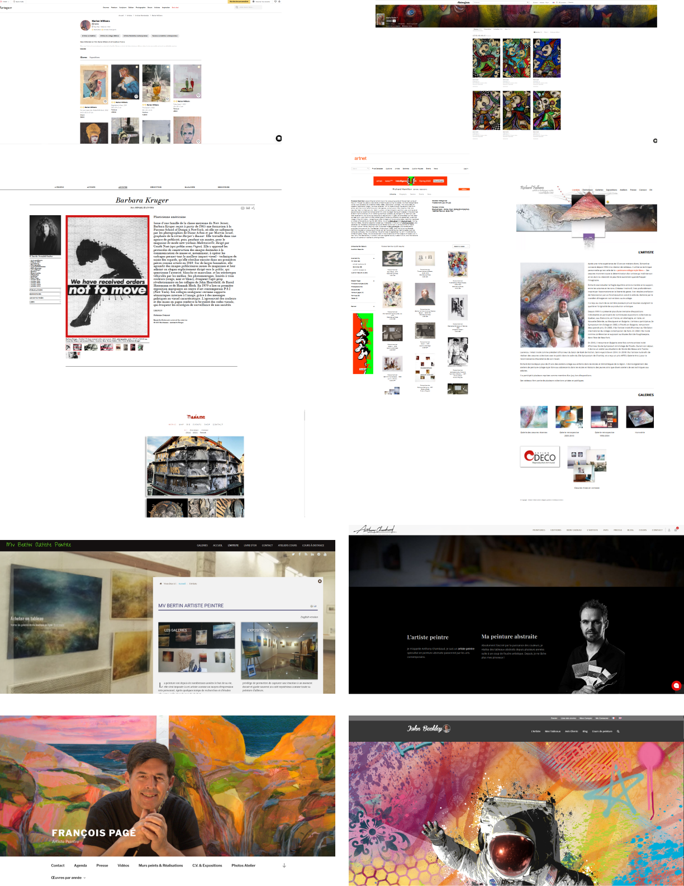

# Projet 1 : Artiste peintre et collagiste

**Itération # A.1 : Analyse**

- Identité visuelle

````
- oeuvres modernes de collages, dessins et peintures mélangés
````

- Stratégie digitale

````
- oeuvres visibles sur Deviant Art
- pas de site Internet
- pas de formulaire de contact mais on peut prendre contact via Deviant Art
- pas de newsletter
- liens via des médias sociaux
````

**Itération #A.2 : Cahier des charges**

- Présentation 
````
- homme
- artiste peintre et collagiste
````

- Cible à laquelle s’adresse le site
````
- le site s'adresse à des adultes avertis appréciant l'art décalé et contemporrain
- le site ne s'adresse ni aux enfants ni aux adultes n'aimant pas l'art contemporrain
````

- État des lieux de l’existant
````
la plupart des oeuvres se trouvent sur Deviant Art
https://www.deviantart.com/drogul-le-mogul
````
- Arborescence du site

````
sur une même page 4 rubriques différentes:
- Biographie
- Gallerie des oeuvres
- Événements (expositions)
- Contact
````
  
- Description fonctionnelle : exemple abonnement à une newsletter, barre de recherche, intégrer un blog, formulaire de contact, carte google…

````
- menu
- formulaire de contact
- lien avec des médias sociaux
````
  
  o Contenu présent sur le site

````
- citation de l'exposition du 16 février au 30 mars 2016
- gallerie de certaines oeuvres
- photos et dates des événements passés
- photo de l'artiste
- biographie de celui-ci
- lien avec les médias-sociaux
- logo
````


**Itération #A.2 : Planche de tendance**
- À partir de sites concurrents (benchmark) ou de site d’inspiration, ajouter les éléments sur votre planche de tendance. Ses éléments peuvent être des captures d’écrans, des palettes de couleurs, des photographies d’ambiances, des échantillons de matières, des croquis et éventuellement du texte.

``
Benchmark
``



* à éviter:

https://moniqueferec.book.fr/galeries/mes-carnets-collages/

https://www.madame.studio/

https://richardfulham.net/

https://www.artsper.com/fr/artistes-contemporains/pays-bas/1537/marian-williams

https://awarewomenartists.com/artiste/barbara-kruger/

http://www.artnet.com/artists/richard-hamilton/

* à faire:
  
https://www.johnbeckley.com/fr/

https://lartiste-peintre.com/

https://francois-page.com/

https://www.chambaud-abstrait.com/

**Itération #A.3 Design System**
- Choisir une convention de nommage, un vocabulaire facile à comprendre pour toutes les personnes impliquées où qui le seront à l’avenir.

``
Design system
``


&nbsp;

``
Moodboard
``


**Itération #A.4 Maquetter le Header**
- Créer la maquette graphique du header de votre page web en choisissant parmi les 2 zoning proposés :
  * 1 composition graphique dans Photoshop
  * Présence de 2 à 3 textes
  * Intégration à minima d’un web font et de deux au maximum.

``
Header Desktop
``


``
Menu Desktop
``


``
Menu Desktop avec survol
``


``
Header responsive
``


``
Menu responsive
``


``
Menu responsive avec survol
``


**Itération #A.5 Zoning contenu principal**
- Faite une proposition de zoning des différentes sections de votre contenu.
- Présenter vos zoning à l’ensemble de votre promo pour validation

``
Zoning Desktop
``


``
Zoning mobile
``


``
Zoning tablette
``


**Itération #A.6 Maquetter le contenu principal**
- Créer la maquette graphique du contenu de votre page web composition graphique dans Photoshop
- Tenir compte de votre Design System
- Maquetter en tenant compte de votre zoning

``
Maquettage Desktop
``


``
Maquettage mobile
``


``
Maquettage tablette
``


**Itération #A.7 Maquetter le pied de page**
- Créer la maquette graphique du pied de page de votre page web en choisissant parmi les 2 zoning proposés :
  
    * 1 composition graphique dans Photoshop
    * Présence de 2 à 3 textes
    * Intégration à minima d’un web font et de deux au maximum
    * Présence du formulaire d’inscription à la newsletter

``
Maquette pied de page Desktop
``


``
Maquette pied de page responsive
``


